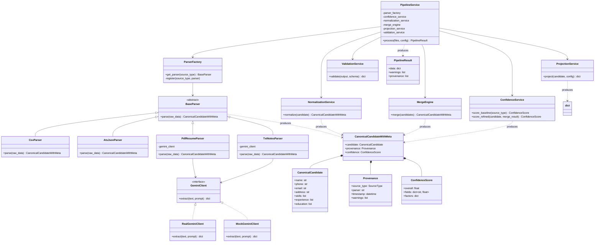

# Architecture

## Pipeline Overview

```
                INPUTS
                   │
                   ▼
            PipelineService
                   │
                   ▼
            Parser Factory
                   │
                   ▼
           Source Parsers
                   │
                   ▼
         Canonical Candidate
                   │
                   ▼
        Baseline Confidence
                   │
                   ▼
           Normalization
                   │
                   ▼
        Conflict Resolution
                   │
                   ▼
        Refined Confidence
                   │
                   ▼
      Config Projection Engine
                   │
                   ▼
           Schema Validation
                   │
                   ▼
             Final Output
```

---

## PipelineService

### Responsibility
Orchestrate the full transformation pipeline. Sequence every stage, collect parsed candidates, handle partial failures, and return the final result with warnings.

### Input
List of uploaded files (with source type metadata) + projection configuration.

### Output
Validated output + list of warnings (one per source failure) + provenance trail.

### Why?
Keeps business logic out of the API layer. The FastAPI endpoint validates the request and delegates to `PipelineService`. The service owns the workflow: parse → baseline score → normalise → merge → refine scores → project → validate.

---
## Parser Factory

### Responsibility
Select the appropriate parser for each input source based on file type, MIME type, or format hint.

### Input
Uploaded file or raw data string with type metadata.

### Output
Concrete parser instance (CSV, ATS JSON, PDF resume, TXT notes).

### Why?
Keeps parser selection logic isolated. Supports the Open/Closed Principle — adding a `LinkedInParser` requires no changes to existing parsers or the factory itself.

---

## Source Parsers

### Responsibility
Convert a source-specific format into the canonical candidate model.

### Input
Raw file content (bytes or string).

### Output
A `CanonicalCandidate` object with provenance metadata attached to each field.

### Why?
Each parser encapsulates the extraction logic for one format. CSV/JSON parsing is rule-based; resume parsing delegates to Gemini for semantic extraction. Format-specific edge cases never leak into downstream services.

On failure, parsers return an empty `CanonicalCandidate` with the error recorded in provenance and a structured warning appended. One parser failure never halts the pipeline.

---

## Canonical Candidate

### Responsibility
Define the universal data model that every parser produces and every downstream service consumes.

### Input
(Internal — the model is instantiated by parsers.)

### Output
A strongly-typed Pydantic model with optional provenance wrappers on every field.

### Why?
Decouples source-specific formats from pipeline logic. Adding a new data source requires only a new parser; the merge engine, normalizers, and projection engine remain unchanged.

---

## Baseline Confidence

### Responsibility
Assign an initial confidence score to every field immediately after parsing, based solely on source reliability and extraction quality.

### Input
A `CanonicalCandidate` with raw values.

### Output
A `CanonicalCandidate` with baseline `ConfidenceScore` attached to each field.

### Base values
- CSV: 0.95
- ATS JSON: 0.95
- PDF Resume (Gemini): 0.80
- TXT Notes (Gemini): 0.70

### Why?
Baseline scores are needed by the merge engine as a tiebreaker during conflict resolution. Computing them after each parse — rather than as a separate batch stage — keeps the pipeline simple and makes the scores available downstream without a second pass.

---

## Normalization

### Responsibility
Transform raw field values into a consistent, standardised format.

### Input
A `CanonicalCandidate` with raw values and baseline confidence scores.

### Output
A `CanonicalCandidate` with normalised values.

### Why?
Parsers extract data as-is from the source. Normalisation applies rules (phone format, email lowercase, address components) so downstream services compare apples to apples.

---

## Conflict Resolution

### Responsibility
When multiple sources provide values for the same field, apply deterministic rules to reconcile discrepancies.

### Input
List of `CanonicalCandidate` objects (one per source), each with baseline confidence scores.

### Output
A single merged `CanonicalCandidate` with the resolved value and provenance.

### Tiebreaker order
1. Source priority (configured per client)
2. Baseline confidence (higher wins)
3. Completeness (more fields populated wins)
4. Recency (most recent timestamp wins)

### Why?
Merge decisions must be explainable and repeatable. Rule-based logic is auditable. AI-generated merge logic is opaque and non-deterministic.

---

## Refined Confidence

### Responsibility
Recalculate confidence scores on the merged candidate by considering agreement across sources, completeness of the profile, extraction quality, and merge consistency.

### Input
Merged `CanonicalCandidate` with provenance.

### Output
A `CanonicalCandidate` with refined `ConfidenceScore` on every field. Only refined scores appear in the final output.

### Refinement factors
- Cross-source agreement (matching values increase confidence)
- Completeness (more populated fields raise record-level score)
- Extraction quality (Gemini extraction confidence from the LLM)
- Normalisation success (failed normalisation lowers score)
- Merge consistency (conflicts that required tiebreakers lower score)

### Why?
Baseline scores are coarse (source-based only). Refined scores reflect the actual quality of the merged result, giving downstream consumers a more accurate signal.

---

## Config Projection Engine

### Responsibility
Transform the canonical model into a client-specific output schema at runtime based on a projection configuration.

### Input
`CanonicalCandidate` + projection configuration (field mappings, transforms, defaults).

### Output
Dictionary or Pydantic model matching the target schema.

### Why?
Different clients require different fields, formats, and naming conventions. A projection engine avoids building one-off endpoints. Configuration-driven means no code changes for new client schemas.

---

## Schema Validation

### Responsibility
Validate the projected output against the target schema before delivery.

### Input
Projected output + target schema definition.

### Output
Validated output or structured validation errors.

### Why?
Catches projection misconfiguration, missing required fields, and type mismatches before data reaches the client. Fail fast, fail clearly.

---

## GeminiClient

### Responsibility
Abstract the Gemini API behind an interface so parsers depend on an abstraction, not a concrete HTTP client.

### Input
Text content (extracted PDF text or raw notes) + extraction prompt.

### Output
Structured JSON matching the canonical model schema.

### Implementations
- `RealGeminiClient` — calls the Gemini API using an API key from environment configuration.
- `MockGeminiClient` — returns deterministic JSON fixtures for unit tests.

### Why?
Dependency inversion makes AI-dependent parsers testable without real API calls. Unit tests use `MockGeminiClient`; integration tests optionally use `RealGeminiClient` behind an environment flag.

---

## Error Handling Strategy

### Per-source failure
Every parser catches its own exceptions and returns a graceful failure:
- An empty or partial `CanonicalCandidate`
- The error recorded in provenance
- A structured warning appended to the result

### Pipeline-level failure
`PipelineService` collects warnings from every source. A failure in one source (e.g., Gemini is down) does not cancel other sources. The API response includes both the merged output (from successful sources) and the warnings array.

### Unrecoverable failures
Only system-level errors (invalid configuration, missing runtime dependencies, internal exceptions) produce an HTTP error response.

---

## Class-Level Architecture


